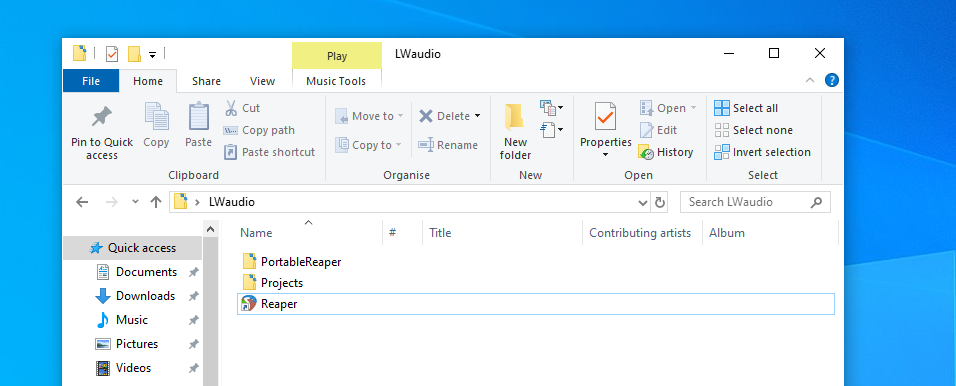
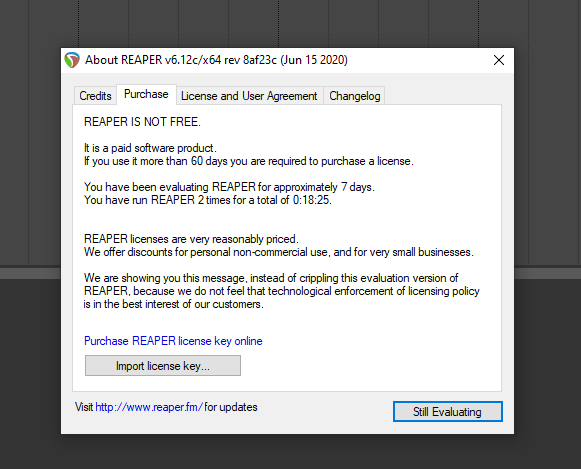
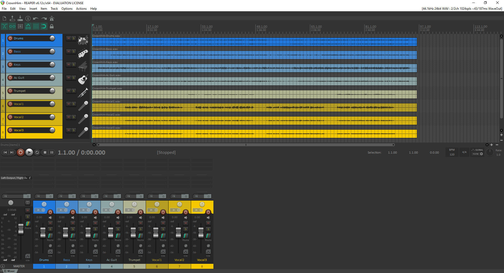

# Sound Production: Setup guide

This page guides you through the steps to setup the software and project files you will need for the [LiveWires](https://livewires.org.uk) audio production course.

The software we will be using in these sessions is called Reaper.
All of the files you will need during the sessions can be found in the Projects folder.

We recommend using the best quality headphones or speakers you have available for this course (preferably headphones).
It will make a surprising difference to how well you can hear the more subtle details of the music you are working on.

## Windows

We have prepared a portable version of Reaper for Windows that will allow you to get going without having to install either Reaper or any plugins.

- Download the [PortableReaperForWindows.zip file](https://scriptureunioncharity-my.sharepoint.com/:u:/g/personal/steveackroyd_scriptureunion_org_uk/EauTGTTLVDlAplu82VmYZnoBxHv_w7kE9JY4C2XYoa4oyA?e=BYrXLj)
- Dowload the [Projects.zip file](https://scriptureunioncharity-my.sharepoint.com/:u:/g/personal/steveackroyd_scriptureunion_org_uk/EatFNqTG8pdAnDUdSlsBVbcB7korhw_PL8LsIJoauo5LMQ?e=lmccSA)
- Extract both the zip files

Inside the extracted Reaper folder you should see a folder called “PortableReaper” and a shortcut to the Reaper application

## Mac, Linux

If you are not using Windows, you will need to download Reaper from [here](https://www.reaper.fm/download.php) and follow the instructions to install it.

You will also need to download and extract the projects.zip file from the link given above

(+ install reverb plugin?)

## Preparing for the first session

When Reaper opens, you will see a message like the one below. If you wait for 5 seconds, the still evaluating option will become available in the bottom right corner

Now it's time to check everything is setup correctly:

- Open Reaper and select “File - Open Project”.
- Navigate to Projects/CrownHim and select the CrownHim project file.

Your window should now look like this:

- You can press “Spacebar” to play and stop the recording. Try this now and check that you can hear the music.

---

[Home](README.md)

[Next page: Session 1](./worksheets/00-intro-to-mixing.md)

---
