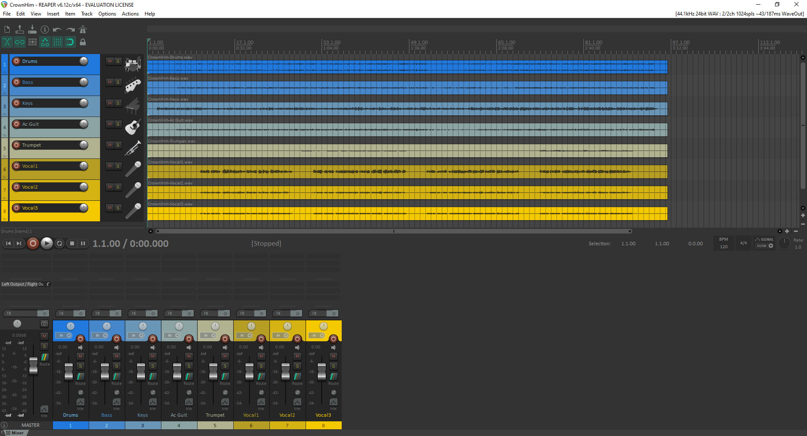

# Intro to Mixing

In this sheet we start the process of mixing.
Before starting on this please make sure you have downloaded Reaper and the project files as explained in the [setup guide](../setup-guide.md)

We are going to start by mixing a song that has already been loaded into Reaper.

If you haven’t already, then open Reaper and select “File - Open Project”.

Navigate to LWaudio/Projects/CrownHim and select the CrownHim project file.

Your window should now look like this:

You can press “Spacebar” to play and stop the recording. Try this now and check that you can hear the music.

The screen is divided into the track view and timeline in the top half and the mixer in the bottom half. In both halves you can see all the tracks listed and access some basic controls but the track view allows you to see the waveform of the recorded audio in the timeline and the mixer view allows you to see the effects you have applied and the volume meter.

Each track has a mute button and a solo button as shown below. These allow you to choose not to hear certain tracks or only to hear certain tracks.
For example you could listen to the instruments without the singers by muting the vocal tracks or listen to the guitar and bass by themselves by soloing them.

 

## Setting Levels

The first step toward creating a good mix is to get the volume of each track right so that everything can be heard and the most important parts sound a little louder than the less important parts.

The way I like to approach this is to pull the volume fader down on all channels but the first. Start the music and bring up each track one at a time. Usually I close my eyes so that I listen  carefully rather than looking at the volume meter. Think about the role of each instrument compared to the other parts you can hear with it.

It is often helpful to do this while listening to the loudest part of the song (in this case verse 4) and then go back and listen to the whole song to see if you are happy with it. If a particular track stands out as too loud turn it down a little and if you can’t hear something then either turn it up or think what else might be drowning it out and need to be turned down instead.

This is perhaps the most important step so take your time and listen to the song a few times to make sure you are happy with it if you need to. There is no “right answer” to this - you may like a particular instrument or voice and choose to let it stand out a little more than somebody else.

## Subgroups

It can be helpful (particularly in projects with more tracks) to set up subgroups. In this case we shall create a vocal subgroup so that all the singers can be turned up or down together with one fader.

Use either “Track - New Track“ or “Ctrl - T” to create a new track.
Double click where the name should be and name it something like “Vocal Group”

To send a track to the new subgroup, click on the route button in the mixer view just below the mute and solo buttons:

This will bring up the following window. To send the track through the subgroup first untick the “Master send” box in the top left, then use the “Add new send…” dropdown menu to select the group track you have just created.

Once all the tracks you want to include are sent to the subgroup, you can use it to mute, solo, change the volume or apply effects to everything in the group at once.

## Panning

Once you are happy with the levels you have set, you can start to spread out the tracks from left to right with the pan control.
If you are wearing headphones then moving a track to one side will have a very noticeable effect. With speakers it is a little bit more subtle.

Have a play with the panning and find some placements that you like. Usually if you move a track to one side it is helpful to move another to the other side to balance it.
For example I have one of the singers left and another right in the picture below. You might like to try moving some of the instruments too.
The drums were recorded in stereo so some of the cymbals are already spread a little to either side.

## Eq

Now that the tracks are well balanced, we can start to apply effects to enhance them further. Eq is a very powerful tool that is used to adjust the sound of a track. For example we could use it to boost the low or high frequencies or perhaps cut a band of frequencies in the midrange.
This becomes more clear when you try it, so I recommend having a play with the Eq plugin to listen to what happens.

To add an effect to a channel, clip on the button labelled “FX” at the top of the track in the mixer view. This should bring up the window shown in the next image, which allows you to pick an effect to add to the track.
The list of effects in Reaper is very long so I recommend that you select “All plugins” - “VST” on the left hand side to narrow the choice down slightly and make it easier to find the ones we will be using.

In this case, select ReaEQ. Once you click add, the effects selection will be replaced by the Eq window. If you close this window and want to bring it up again then you can click on the box that will now say “ReaEQ” in the mixer view on the track you have just added the effect to.

The top half of the Eq window shows a graph and the bottom half has a number of controls. You can control the plugin using either, but I find it easier to drag the points around on the graph most of the time.

If you solo the track you have applied the effect to, set the music playing and start to drag the points around you should be able to hear the impact it has.

Have a play with the Eq on a selection of tracks and get used to the way it works - you can use the “Add band” button to get more points on the graph to work with.
You can click on the green “FX” button in the mixer view to turn the effect off and on to hear the sound with an without the Eq.

See if you can use it to help particular tracks either blend in more or stand out more from the rest of the band.

## Reverb and Delay

Reverb and delay (echo) are effects that can add a sense of space to a recording. Often we want to apply them to more than one track, so it can be helpful to set up a separate track or “bus” for them and send other tracks to it.

Create and name a new track “Reverb” in the same way that you did for the subgroup.
Add the OrilRiver effect the same way as we previously added the ReaEQ.
This time when setting up the routing, we want to leave “Master send” ticked.

It should now look something like the picture below. Notice that a “Verb” send has appeared on the Vocal Group channel below the slots where effects normally appear.
By clicking and dragging the control on the right of this send, you can change the amount of the vocal group being sent to the reverb effect. This is the best way to control how much reverb is applied to each channel.
If you click and drag anywhere else on the Verb send, you can copy it to other tracks to send them to the reverb effect too.

If you click on the OrilRiver plugin, its window will appear. If you click in the box at the top that says “Default”, you can find a range of different presets to try.
I recommend listening to Large Room, Plate, Cathedral 1 and Deep cave to get an idea of what the reverb can do.
Each time that you select a different preset, you should click the “Dry” button in the top left to make sure that it is lit up orange.

You can set up a delay effect the same way by selecting ReaDelay instead of OrilRiver. (You might want to mute any reverb while you play with delay though)
With delay I recommend setting it by hand rather than starting with the presets. The plugin should look like the image below:

I first recommend pulling the dry control on the left all the way down to the bottom. You can then use the length control to set how quickly the echo repeats the original sound and the feedback to control how many times the echo repeats.

To get a feel for the controls I suggest sending the vocal group to the delay with solo turned on.
Good starting settings might be 2 ⅛ notes for length and between -10 and -15 for feedback.
As before, you can change the send level to get more or less of the delayed sound.

Play around with the reverb and delay until you feel comfortable with what they do. You could try them on a variety of tracks and see what happens when you change some of the other controls. You could even try sending delay to reverb or vice versa.

These aren’t tools that you will want for every song and are often kept quite subtle - it very much depends on the style of music but they are very common tools that it is good to have at your disposal.

## Setting up a session

In the previous example, the project you opened was already set up and ready to go. Now you will set up a project from scratch with the recordings provided.

The song we shall mix this time is Glorious Christ. The band is the same (except for a change of singer) and you will find 8 tracks in the Projects folder.

Start by opening a new project in Reaper “File - New Project“ or “Ctrl - N”.
With a blank project open, you can select the tracks in the projects folder and drag and drop them into Reaper. Select the option to import them to separate tracks if asked.

At this point it is a good idea to save the project so press “Ctrl - S”, navigate to the Projects folder, give your project a name and check that the boxes for “Create subdirectory for project” and “Move all media into project directory” are ticked.
From this point on you can keep typing “Ctrl - S”, as you progress to ensure that the saved version is kept up to date.

The next few steps are to lay out the project in a clear and helpful way before we start mixing. This is optional but I find it helpful so that I can always find the track I want easily.

First, I want to make all the tracks appear smaller in the timeline view so that I can see them all at once. To do this, you can bring my mouse over one of the tracks to the left, hold “Ctrl” and scroll down with the mousewheel. Alternatively you can place the mouse at the bottom of each track and click and drag to set the height for that track.

To ensure the whole project fits into the timeline, place your mouse over one of the audio files on the timeline and scroll the mouse wheel down to zoom out.

If you are editing particular tracks it may be helpful to make them taller or zoom in on the timeline while you work on them but I generally like to see the whole project while I am mixing.

Next I rename the tracks if needed. In this case it is helpful to remove the “GloriousChrist-” from the start of each track name so that you can more easily see what each track is. To edit this, double click on the track name.

I also find it helpful to reorder the tracks in a way that makes sense to me. I personally like to have instruments first, then voices and I tend to start with percussion then go from lowest to highest. In this case I have Drums, Bass, Keys, Guitar, Trumpet, V1, V2, V3.
To move a track to a different place, click and drag it to the place you want it.

At this point everything should be laid out clearly and you can save the project and begin mixing as we did with the previous example.

You may want to set up extra tracks for subgroups, reverb or delay.

To make things more pretty, you can right click on the tracks and find the track colour and track icon options as shown below.

To mix the song think about: volumes, panning, Eq, and other effects (reverb or delay)

## Taking things further

In the next session, we shall start to introduce more ideas and techniques, but if you would like to try what we have covered in this session with other recordings then this website has collections of tracks to download in a whole variety of genres.

They are all professionally recorded and have a variety of track counts from just three or four to over 40. You can select based on genre and and listen to a preview clip of each song before downloading the tracks. (Scroll down to see the list)

[Cambridge Music Technology Multi-track Library](https://cambridge-mt.com/ms/mtk/)
