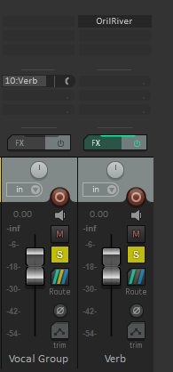
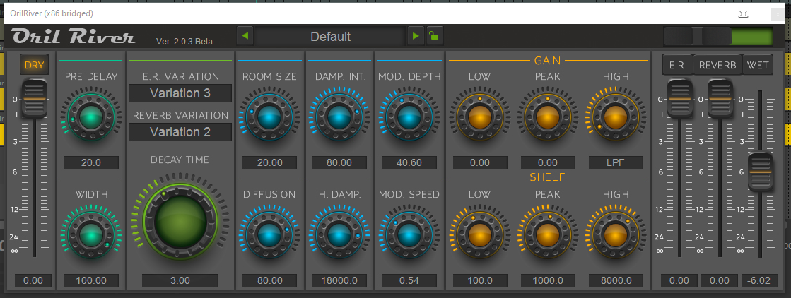
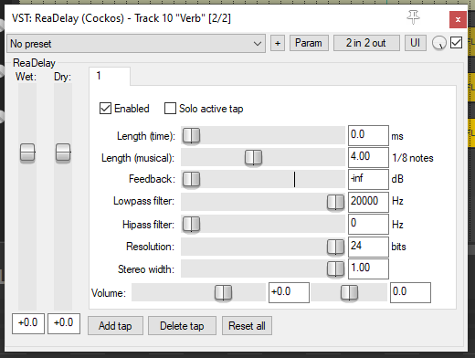

# Reverb and Delay

Reverb and delay (echo) are effects that can add a sense of space to a recording. Often we want to apply them to more than one track, so it can be helpful to set up a separate track or “bus” for them and send other tracks to it.

Create and name a new track “Reverb” in the same way that you did for the subgroup.
This time when setting up the routing, we want to leave “Master send” ticked on the channels we are sending to the reverb channel. (Unless it is already unticked for a sub-group.)
Add the OrilRiver effect the same way as we previously added the ReaEQ.

It should now look something like the picture below. Notice that a “Verb” send has appeared on the Vocal Group channel below the slots where effects normally appear. (For the example in the picture, I shortened "Reverb" to "Verb".)
By clicking and dragging the control on the right of this send, you can change the amount of the vocal group being sent to the reverb effect. This is the best way to control how much reverb is applied to each channel.
If you click and drag anywhere else on the Verb send, you can copy it to other tracks to send them to the reverb effect too.

If you click on the OrilRiver plugin, its window will appear. If you click in the box at the top that says “Default”, you can find a range of different presets to try.
I recommend listening to Large Room, Plate, Cathedral 1 and Deep cave to get an idea of what the reverb can do.
Each time that you select a different preset, you should click the “Dry” button in the top left to make sure that it is lit up orange.
"Wet" and "dry" refer to the sound with and without the effect added. The dry sound is the original and the wet is with the effect applied. 

You can set up a delay effect the same way as the reverb by selecting ReaDelay instead of OrilRiver. (Create and name a new track, then send other tracks to it.)
You will probably find it easiest to mute any reverb while you play with delay though.
With delay I recommend setting it by hand rather than starting with the presets. The plugin should look like the image below:

I first recommend pulling the dry control on the left all the way down to the bottom. You can then use the length control to set how quickly the echo repeats the original sound and the feedback to control how many times the echo repeats.

To get a feel for the controls I suggest sending the vocal group to the delay with solo turned on.
Good starting settings might be 2 ⅛ notes for length and between -10 and -15 for feedback.
As before, you can change the send level to get more or less of the delayed sound.

Play around with the reverb and delay until you feel comfortable with what they do. You could try them on a variety of tracks and see what happens when you change some of the other controls. You could even try sending delay to reverb or vice versa.

These aren’t tools that you will want for every song and are often kept quite subtle - it very much depends on the style of music but they are very common tools that it is good to have at your disposal.

---

[Next page: setting up a project](03-setting-up-project.md)

[Last page: Eq](01-eq.md)

[Home](../README.md)

---
