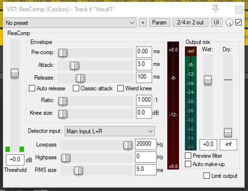

# Compression

A compressor is another effect that can be added to a track like the Eq. The role of a compressor is to reduce changes in volume. If you have an instrument or singer who gets louder and quieter through the song that can be great, it can really help to build up the emotion of the music. Sometimes though it is unhelpful and a compressor can help to reduce this if we want a more consistent volume.

As the compressor only makes small adjustments to the volume and doesn’t really change the sound of the track very much it can be difficult to hear it making a difference but it really does help if a track is getting drowned out at its quietest points but you don’t want to turn it up and make it too loud at its loudest points.

The compressor in Reaper is called ReaComp and can be added in the same way as the effects we have seen already.

The image above shows what the compressor window looks like.
The two most important controls are the threshold (on the left) and the ratio (in the middle).

A compressor works by turning down the loudest parts of the track so that they are not too much louder than the quiet parts.

The ratio controls how much the volume is reduced by. I suggest setting it somewhere around 3 or 4 to begin with and then changing it later on if you want more or less compression.

Whenever the volume goes above the threshold, the compressor will start to turn the volume down. Bring the threshold down until the loudest parts of the track are louder than the threshold level.
You will see compression starting to happen in the red bar towards the right side. This shows how much the volume is being turned down over time.

It may be that you wanted the compressor to help make the quieter bits louder rather than the loud bits quieter. If so you can use the “Wet” control on the right side to turn up the output volume from the compressor. I usually aim for it to add about the same amount of volume as the compressor turns down in the red bar.

---

[Next page: Automation](05-automation.md)

[Last page: Setting up a project](03-setting-up-project.md)

[Home](../README.md)

---
