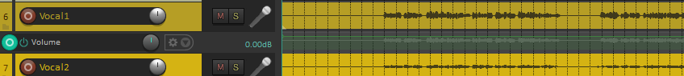

# Automation

Sometimes we want settings to change during the song. For example, you may want to have an instrument at one volume for most of the song but make it louder while it plays a solo in the middle of the song. Automation allows you to change settings as the song is playing.

The simplest thing to automate is volume but you can automate pretty much any setting. Panning is a common thing to automate as you can make tracks move from side to side.
You can even automate the settings of effects like Eq or reverb.

To apply automation to a track, select the track you want to automate and press “V” this will add an extra row in the timeline with a green line labelled volume.

If you hold down “Ctrl” then you can use the mouse to draw over the green line with the changes you want to make. To get more control you can click at points where you want the changes to begin and end then release “Ctrl” and click and drag segments of the green line between the points you have made.

If you click on the label that says “Volume” in the left hand side, you will bring up a menu that allows you to change other parameters. The most useful ones for you will probably be Volume, Pan, Mute and any settings for FX that you have added to the tracks.

---

[Home](../README.md)

[Last page: Compression](04-compression.md)

[Next page: Exporting a project](06-exporting.md)

---
