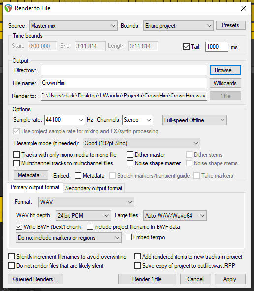

# Exporting a project

To export a song from Reaper as a single audio file, you need to render it. Go to “File - Render...“ or press ”Ctrl + Alt + R“
This will bring up a window that looks like the picture below.

The only settings you need to check are:
- Source and Bounds at the very top - these should be set to Master mix and Entire project
- Directory and File name - these set where it will be saved and what it will be called
- Format - WAV is good for a high quality file. MP3 can be used instead if you want to have a smaller output file.

Once you have checked each of these, you can click the “Render 1 file” button at the bottom and wait a few seconds for the render to complete before closing the render window.

---

[Home](../README.md)

[Last page: Automation](05-automation.md)

[Next page: Taking things further](07-taking-things-further.md)

---
